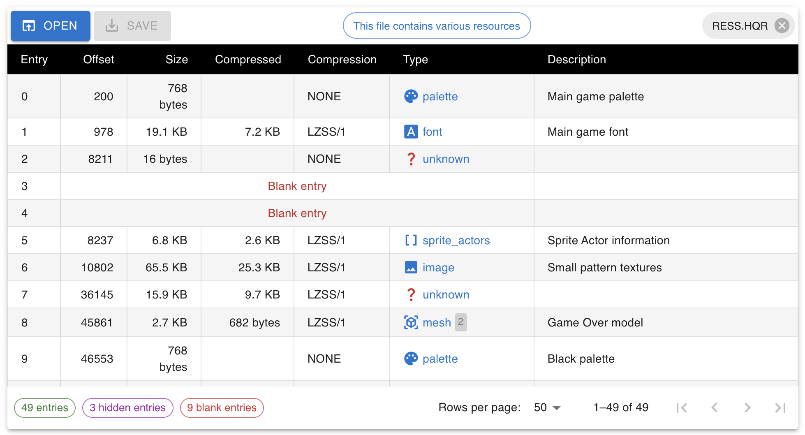

# LBA Packager

A web based [HQR files editor][lba-packager-site]:



HQR is a file format used by the Little Big Adventure 1 & 2 games for storing game assets.

This project is intended to be an easy to use, multi-platform modern alternative to exisiting tools such as [LBADeCOMP][lba-decomp] or [LBA Pack Editor][lba-pack-editor].

Internally, LBA Packager makes use of LBALab's [HQR Javascript library][hqr-lib-npm], to read and write HQR files.

Contributions to both this repository as well as the [library][hqr-lib-repo] are welcome!

## Getting started

Those instructions are for developpers who want to contribute to the project.

If you just want to use LBA Packager, just head to the [website][lba-packager-site] and start editing your HQR files.

### Requirements

You need the latest version of [nodejs][nodejs] installed on your computer.

Then run the following commands:

```
npm install
```

```
npm start
```

Browse to http://localhost:3000/

[lba-packager-site]: https://lbalab.github.io/lba-packager/
[hqr-lib-npm]: https://www.npmjs.com/package/@lbalab/hqr
[hqr-lib-repo]: https://github.com/LBALab/hqr
[lba-decomp]: https://www.magicball.net/downloads/programs/development/lbadecomp_1_2
[lba-pack-editor]: http://moonbase.kaziq.net/index.php?page=d_prog
[nodejs]: https://nodejs.org/en/
